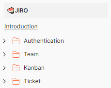

<div align="center">
  
</div>

# 프로젝트 분석 및 관리 툴
 칸반보드 기반 칸반 티켓을 만들어 일정을 관리하는 `Backend API`입니다.

<br/>

## 목차
- [개요](#개요)
- [Skill](#Skill)
- [Installation](#Installation)
- [Running Tests](#running-tests)
- [API Reference](#api-reference)
- [프로젝트 진행 및 이슈 관리](#프로젝트-진행-및-이슈-관리)
- [구현과정(설계 및 의도)](#구현과정(설계-및-의도))
- [TIL 및 회고](#til-및-회고)

<br/>

## 개요
해당 서비스는 프로젝트 및 작업 관리를 위한 직관적이고 유연한 도구로, 
팀 간 협업과 업무 효율성을 향상을 목표로 합니다.

`주요기능`
> 1. 유저는 본 사이트에 들어와 회원가입을 통해 서비스를 이용합니다.
> 2. 칸반보드(Kanban Board) 기능을 사용하여 프로젝트 진행을 관리합니다.
> 3. `Ticket`을 통해 팀원은 자신의 작업을 관리합니다.
> 4. `팀장`은 소속 팀원들의 작업량을 다양한 지표로 확인합니다.

<br>

## Skill
언어 및 프레임워크:  <br/>
데이터 베이스:  <br/>
배포 :     <br/> ETC :  

<br/>


## Installation

Install my-project with npm

```bash
  # Package 설치
  npm install my-project
  cd my-project
  
  # 초기 설정 : 데이터 및  스케쥴러 실행
  npm install my-project
  cd my-project
```

<br/>


## Running Tests

To run tests, run the following command

```bash
  ./gradlew test
```

> Coverage ScreenShot 


<br/>

## API Reference
> [](https://documenter.getpostman.com/view/18383272/2s9YeBct5f#intro)<br>
> 

<br/>

## 프로젝트 진행 및 이슈 관리

[](https://bow-hair-db3.notion.site/cdb6eb37500b4580a80252ea3d7c3963?pvs=4)

<br/>


## TIL 및 회고
- [Stream() 정렬하기](https://diligent-mangosteen-06d.notion.site/Stream-eed618c7385b4078875984b6d57917f8?pvs=4)

<br/>